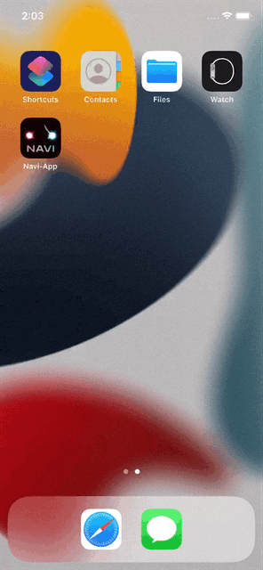
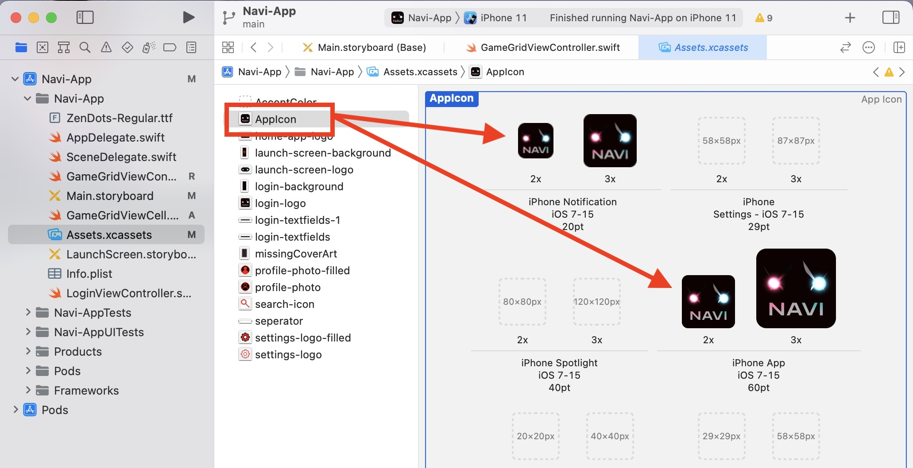
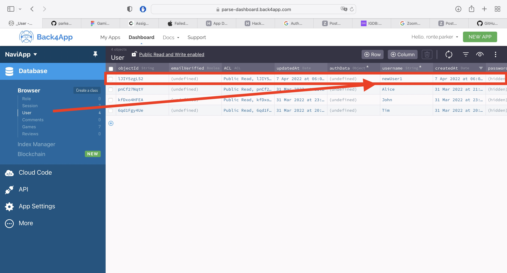
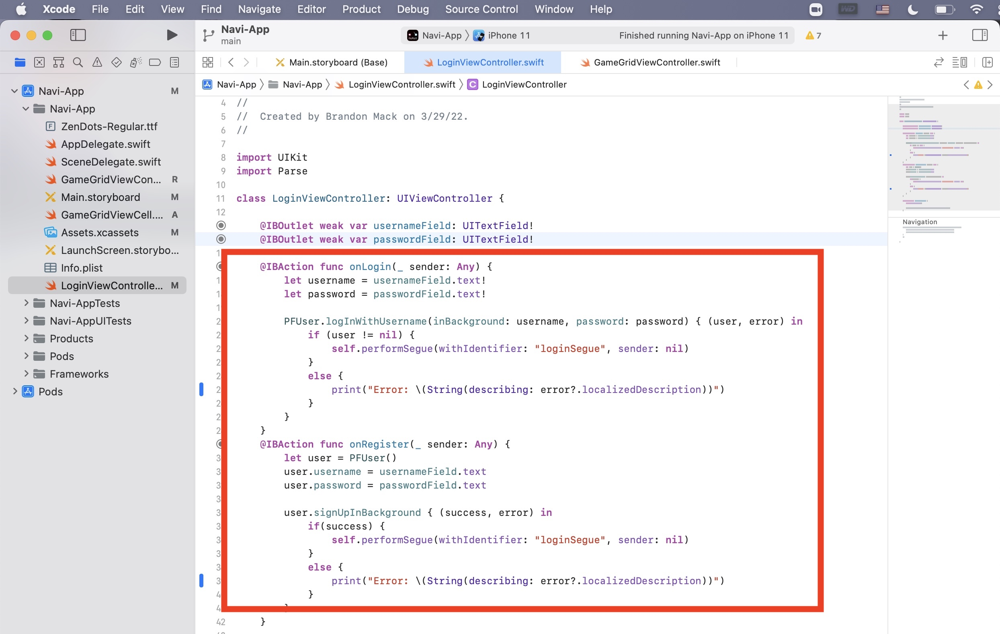
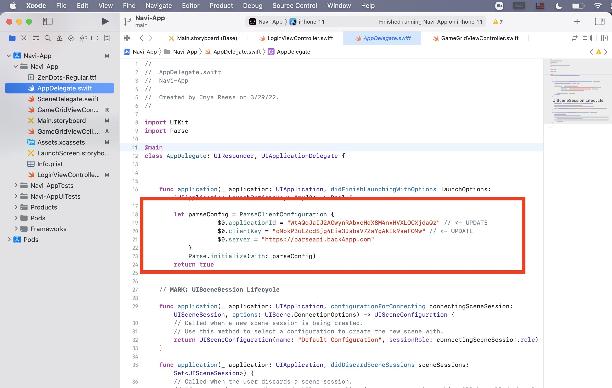
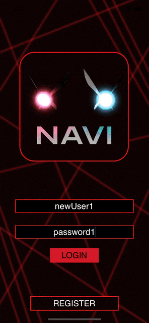
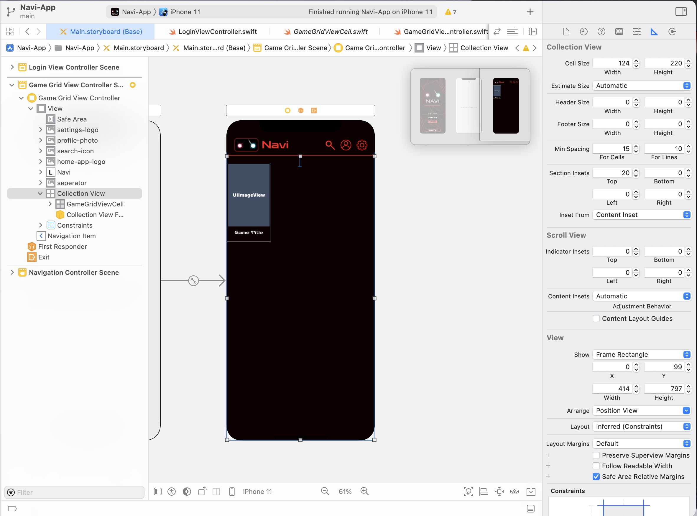

# Navi Games

## Table of Contents
1. [Overview](#Overview)
2. [Product Spec](#Product-Spec)
3. [Wireframes](#Wireframes)
4. [Schema](#Schema)
5. [Milestone Deliverables](#Milestone-Deliverables)

## Overview
### Description
An app that allows users to search through their favorite games to write and read reviews from other users.

### App Evaluation
[Evaluation of your app across the following attributes]
- **Category:** Games, Social Networking
- **Mobile:** Mobile app environment uses camera and has a real-time updated experience.
- **Story:** Allows users to share their experiences with games, and view opinions on games they plan to buy.
- **Market:** People who like games could enjoy this app. Allows people to search for specific game. Also, allows for discourse and conversations around games.
- **Habit:** Users can view and post reviews on an ever increasing list of games. Each of which having multiple reviews and each of those reviews having comment chains. This encourages the user to keep coming back daily. It is habit forming.
- **Scope:** A very feasible app that has a narrow focus. It's just posting reviews/comments and viewing those posts. Even the basic version of this app would still be interesting to build and use. The app, Navi, is a very clearcut, defined product idea.

## Product Spec

### 1. User Stories (Required and Optional)

**Required Must-have Stories**

* User can log-in/register
* User can search through games
* User can see ratings
* User can write/see a review
* User can rate game on 1-5 in the review
* User can see a feed of game posters
* User can see detailed game information
* User can see reviews and comments after clicking on game poster
* User can comment on a review

**Optional Nice-to-have Stories**

* User can rank specific gaming categories for a review
* User can upvote/downvote reviews
* User can view their Profile Page
* User can favorite games to view in Favorite Game Section
* User can switch between light/dark mode
* User can add a profile image
* If user profile pages show their own comments, also include a settings navigation screen

### 2. Screen Archetypes

#### Required Screens

* Login Screen
    * User can log-in/register
* Home Screen (Shows Games Feed)
    * User can see a feed of game posters
    * User can search through games
* Game Detail Screen
    * User can see detailed game information
    * User can see ratings
    * User can see/write a review
    * User can rate game on 1-5 in the review
    * User can see reviews and comments after clicking on game poster
    * User can comment on a review

#### Optional Screens
*All From Required*

* Profile Screen
    * User can add/see a profile image
    * User can see recent reviews
    * User can see list of favorite games

* Game Detail Screen
    * User can upvote/downvote reviews
    * User can mark a game as favorite
    
* Favorite Screen
    * User can see a feed of game cover art they marked as favorite
    * User can tap on a cover to take them to the game detail screen

* Settings Screen
    * User can switch between light/dark mode
    * User can change username
    * User can change password
    * User can change profile picture

### 3. Navigation

**Tab Navigation** (Tab to Screen)

* No required tabs

**Flow Navigation** (Screen to Screen)
* Navigation Button allows user to return to previous screen

* Login Screen
    * Login Button => Home Screen
    * Register Button => Home Screen
   
* Home Screen
    * Game Cover Art (Tapable Cell) => Game Detail Screen
        * Infinite Scroll
    * [Optional] Profile Button => Profile Screen

* Game Detail Screen
    * (End of the Flow)

## Wireframes
### [BONUS] Digital Wireframes & Mockups


## Schema 

### Models

#### Users
| Property      | Type     | Description |
|---------------|----------|-------------|
| username      | String   | Unique id for user|
| password      | String   | Unique password for user|
| userPFP       | File     | Image of User's profile picture |
| usrTopGenre   | String   | User's Chosen Top Genre |
| userTopGame   | String   | User's Chosen Fav Game |

#### Games
| Property      | Type     | Description |
|---------------|----------|-------------|
| gameTitle     | String   | Title of game |
| gamePoster    | File     | Image of Game Cover Art |
| gameDesc      | String   | Brief summary of the game |
| gameAvgRating | Number   | 1-5 Average Rating from all ratings |

#### Reviews
| Property      | Type     | Description |
|---------------|----------|-------------|
| objectID      | String   | Unique ID for each review |
| reviewMsg     | String   | User created review message |
| rating        | Number   | 1-5 Rating of Game |
| author        | Pointer to User | Author's username |
| Game          | Pointer to Game | Game this review belongs to |

#### Comments
| Property      | Type     | Description |
|---------------|----------|-------------|
| objectID      | String   | Unique ID for each post |
| author        | Pointer to User | Author's username |
| commentMsg    | String   | Author's Comment Message |
| parentReview  | Pointer to Review | Review this comment belongs to |


### Networking

#### Login/Register
- Create/Post: Creating a new user storing: username, password
   ```swift
   let newUser = PFObject(className:"User")
   newUser["uesrname"] = username
   newUser["password"] = password
   newUser["userPFP"] = null
   newUser.saveInBackground { (succeeded, error)  in
       if (succeeded) {
           print("Created New user")
       } else {
           print(error.localizedDescription)
       }
   }
   ```
- Read/Get: Query all users where username is the entered username
   ```swift
   let query = PFQuery(className:"User")
   query.whereKey("author", equalTo: usernameEntered)
   query.findObjectsInBackground { (user: [PFObject]?, error: Error?) in
      if let error = error {
         print(error.localizedDescription)
      } else if let user = user {
         print("Found user: " + user[0])
         // TODO: Do something with user...
      }
   }
   ```

#### Home Screen
- Read/Get: Get Games Information (Game Poster, Game Name)
   ```swift
   let query = PFQuery(className:"Games")
   query.whereKey("author", equalTo: )
   query.findObjectsInBackground { (games: [PFObject]?, error: Error?) in
      if let error = error {
         print(error.localizedDescription)
      } else if let games = games {
         print("Found games count: " + games)
         // TODO: Do something with games...
      }
   }
   ```
- Read/Get: Query Current User & Get User's Profile Picture
   ```swift
   let query = PFQuery(className:"User")
   query.whereKey("author", equalTo: currentUser)
   query.findObjectsInBackground { (user: [PFObject]?, error: Error?) in
      if let error = error {
         print(error.localizedDescription)
      } else if let user = user {
         print("Found user: " + user[0])
         // TODO: Do something with user...
      }
   }
   ```

#### Game Description
- Read/Get: Get Reviews w/ all the information (Review Message, Author, Author Picture, Rating, Comments)
   ```swift
   let query = PFQuery(className:"Reviews")
   query.whereKey("gameTitle", equalTo: game)
   query.findObjectsInBackground { (reviews: [PFObject]?, error: Error?) in
      if let error = error {
         print(error.localizedDescription)
      } else if let reviews = reviews {
         print("Found reviws count: " + reviews)
         // TODO: Do something with reviews...
      }
   }
   ```
- Update/Put: Updating Overall Average Game Rating whenever a new review is created
   ```swift
   let query = PFQuery(className:"Games")
   query.getObjectInBackground(withId: currentGame["objectID"]) { (game: PFObject?, error: Error?) in
       if let error = error {
           print(error.localizedDescription)
       } else if let game = game {
           game["avgRating"] = (game["avgRating"] + newRating) / 2
           game.saveInBackground()
       }
   }
   ```
- Create/Post: User creates a review for this specific game inputing specific message and rating
   ```swift
   let newReview = PFObject(className:"Reviews")
   newReview["reviewMsg"] = message
   newReview["author"] = currentUser
   newReview["game"] = currentGame
   newReview["rating"] = userRating
   newReview["objectID"] = RandomID()
   newReview.saveInBackground { (succeeded, error)  in
       if (succeeded) {
           print("Created New user")
       } else {
           print(error.localizedDescription)
       }
   }
   ```

#### Profile
- Read/Get: Get User's information (Username, Profile picture, Top Genre, Top Game)
   ```swift
   let query = PFQuery(className:"User")
   query.whereKey("author", equalTo: currentUser)
   query.findObjectsInBackground { (user: [PFObject]?, error: Error?) in
      if let error = error {
         print(error.localizedDescription)
      } else if let user = user {
         print("Found user: " + user[0])
         // TODO: Do something with user...
      }
   }
   ```
- Read/Get: Get User's Reviews
   ```swift
   let query = PFQuery(className:"Reviews")
   query.whereKey("author", equalTo: currentUser)
   query.findObjectsInBackground { (reviews: [PFObject]?, error: Error?) in
      if let error = error {
         print(error.localizedDescription)
      } else if let reviews = reviews {
         print("Found reviews count: " + reviews)
         // TODO: Do something with user...
      }
   }
   ```
#### Setting
- Update/Put: Update User's username/password/profile picture
   ```swift
   let query = PFQuery(className:"Users")
   query.getObjectInBackground(withId: currentUser["objectID"]) { (user: PFObject?, error: Error?) in
       if let error = error {
           print(error.localizedDescription)
       } else if let user = user {
           user["username"] = newUsername
           user["password"] = newPassword
           user["userPFP"] = newPFP
           user.saveInBackground()
       }
   }
   ```


## Milestone Deliverables

### Sprint 1 - Unit 10

**Launch Screen**
- [x] Finalize logo
- [x] User can see styled launch screen upon opening app
- [x] Add app icon to app assets
- [x] User can see logo on phone's home screen




**Login/Register Screen**
- [x] User can log-in
- [x] User can register
- [x] Login page visuals
- [x] Connect Login to Parse/Back4App






**Home Screen Pt. 1**
- [x] Setup Grid View for Movies List
- [x] Setup Cell View for Movie
- [x] Add visual design
- [x] User can see collection view of a few games



